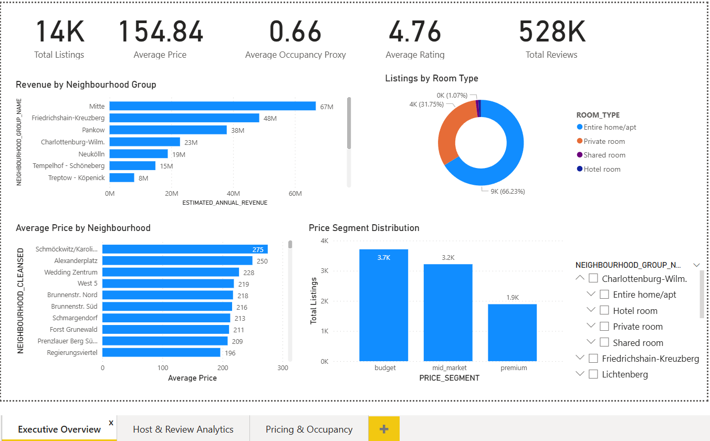
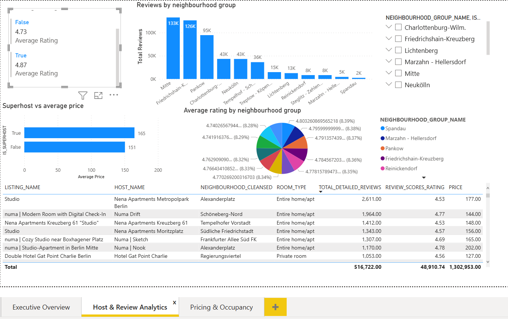
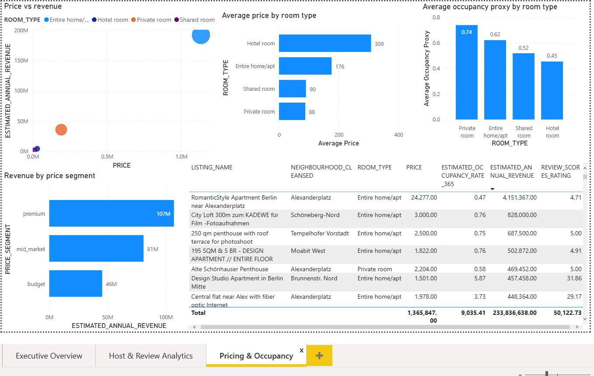
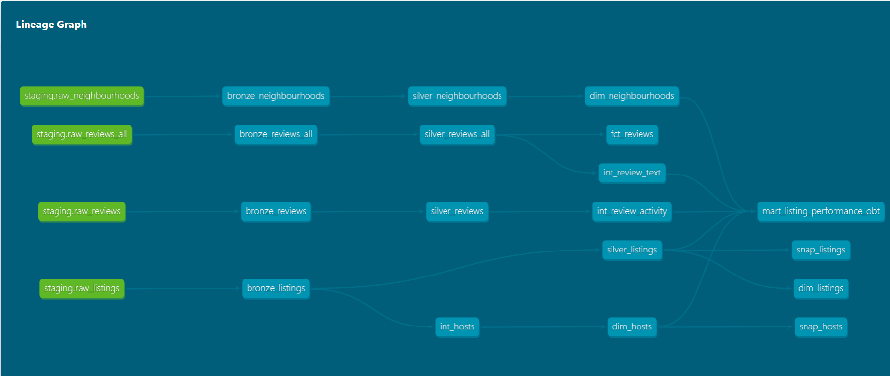

# Berlin Airbnb Analytics Engineering Pipeline

## 📋 Overview

This project implements an end-to-end analytics engineering pipeline for Airbnb listings and reviews data from Berlin using Snowflake, dbt, AWS S3, and Power BI.

The pipeline follows a modern medallion architecture (**Bronze → Silver → Gold**) and demonstrates analytics engineering best practices including:

* Incremental loading
* Dimensional modeling (Star Schema)
* One Big Table (OBT) modeling
* Ephemeral models
* Snapshots (SCD Type 2)
* Data quality testing
* Interactive BI dashboards
* dbt lineage tracking

The project uses the Berlin Airbnb dataset from Kaggle and transforms raw CSV files into analytics-ready datasets for business intelligence and reporting.

---

# 🏗️ Architecture

## Data Flow

```text
Berlin Airbnb CSV Dataset
        ↓
AWS S3
        ↓
Snowflake Staging Layer
        ↓
dbt Bronze Layer
        ↓
dbt Silver Layer
        ↓
Ephemeral / Intermediate Models
        ↓
Gold Layer (Star Schema + OBT)
        ↓
Power BI Dashboard
```

---

# 🛠️ Technology Stack

| Category                 | Technology             |
| ------------------------ | ---------------------- |
| Cloud Storage            | AWS S3                 |
| Cloud Data Warehouse     | Snowflake              |
| Transformation Framework | dbt                    |
| BI & Visualization       | Power BI               |
| Language                 | SQL + Jinja            |
| Version Control          | Git & GitHub           |
| Data Modeling            | Star Schema            |
| Data Architecture        | Medallion Architecture |

---

# 📊 Key Features

## ✅ Medallion Architecture

The project follows a layered architecture:

### 🥉 Bronze Layer

Raw ingestion with minimal transformations.

### 🥈 Silver Layer

Cleaned, standardized, and business-ready transformations.

### 🥇 Gold Layer

Analytics-ready dimensional models and marts optimized for BI consumption.

---

## ✅ Incremental Models

Incremental loading was implemented in bronze and silver models to process only new records efficiently.

Example:

```sql
{{ config(materialized='incremental') }}
```

---

## ✅ Star Schema Modeling

The gold layer includes:

### Dimension Tables

* `dim_listings`
* `dim_hosts`
* `dim_neighbourhoods`

### Fact Table

* `fct_reviews`

### Analytics Mart

* `mart_listing_performance_obt`

---

## ✅ Ephemeral Models

Reusable intermediate transformation logic was implemented using dbt ephemeral models:

* `int_hosts`
* `int_review_activity`
* `int_review_text`

These models reduce warehouse clutter while improving modularity.

---

## ✅ Snapshots (SCD Type 2)

Snapshots track historical changes in:

* listings
* host attributes

Implemented using dbt snapshots:

* `snap_listings`
* `snap_hosts`

---

## ✅ Data Quality Testing

Implemented dbt tests including:

* `not_null`
* `unique`
* `relationships`

All tests successfully passed.

---

# 📁 Project Structure

```text
berlin_airbnb_project/
│
├── models/
│   ├── bronze/
│   │   ├── bronze_listings.sql
│   │   ├── bronze_reviews.sql
│   │   ├── bronze_reviews_all.sql
│   │   └── bronze_neighbourhoods.sql
│   │
│   ├── silver/
│   │   ├── silver_listings.sql
│   │   ├── silver_reviews.sql
│   │   ├── silver_reviews_all.sql
│   │   └── silver_neighbourhoods.sql
│   │
│   ├── ephemeral/
│   │   ├── int_hosts.sql
│   │   ├── int_review_activity.sql
│   │   └── int_review_text.sql
│   │
│   ├── gold/
│   │   ├── dim_hosts.sql
│   │   ├── dim_listings.sql
│   │   ├── dim_neighbourhoods.sql
│   │   ├── fct_reviews.sql
│   │   └── mart_listing_performance_obt.sql
│   │
│   └── sources/
│       └── sources.yml
│
├── snapshots/
│   ├── snap_hosts.sql
│   └── snap_listings.sql
│
├── tests/
│
├── seeds/
│
├── analyses/
│
├── macros/
│
├── dbt_project.yml
│
└── README.md
```

---

# 📈 Data Modeling

## Gold Layer Design

### Star Schema

The warehouse was modeled using a dimensional approach:

```text
dim_hosts
dim_listings
dim_neighbourhoods
        ↓
    fct_reviews
```

---

## One Big Table (OBT)

A denormalized analytics mart was created:

```text
mart_listing_performance_obt
```

The OBT combines:

* listings
* hosts
* neighbourhoods
* review metrics
* occupancy metrics
* revenue metrics

This model was used directly in Power BI for dashboarding.

---

# 📊 Power BI Dashboard

The Power BI dashboard includes 3 analytics pages:

## 1. Executive Overview

* Revenue by neighbourhood
* Listings by room type
* Price segment distribution
* KPI metrics



## 2. Host & Review Analytics

* Superhost performance analysis
* Review trends
* Ratings by neighbourhood
* Top reviewed listings



## 3. Pricing & Occupancy

* Price vs revenue analysis
* Occupancy proxy analysis
* Revenue segmentation
* Top performing listings


---

# 🔄 dbt Lineage Graph

The project includes full dbt lineage tracking across:

* sources
* bronze
* silver
* intermediate
* marts
* snapshots

This improves:

* traceability
* maintainability
* dependency management


---

# 🧪 Running the Project

## Install dbt

```bash
pip install dbt-core dbt-snowflake
```

---

## Test Snowflake Connection

```bash
dbt debug
```

---

## Run Models

```bash
dbt run
```

---

## Run Tests

```bash
dbt test
```

---

## Run Snapshots

```bash
dbt snapshot
```

---

## Generate Documentation

```bash
dbt docs generate
dbt docs serve
```

---

# 📌 Business Questions Answered

This project explores business questions such as:

* Which Berlin neighbourhoods generate the highest estimated revenue?
* Do superhosts outperform regular hosts?
* Which room types maximize occupancy?
* How does pricing affect occupancy and revenue?
* Which market segments dominate Berlin Airbnb listings?

---

# 📚 Dataset

Dataset: Berlin Airbnb Open Data (Kaggle)
https://www.kaggle.com/datasets/mahmoudkhater99/berlin-airbnb-dataset

Includes:

* Listings
* Reviews
* Neighbourhoods

---

# 🔐 Best Practices Implemented

* Layered medallion architecture
* Modular dbt transformations
* Incremental processing
* Dimensional modeling
* Snapshot history tracking
* Data quality testing
* Reusable SQL logic
* Analytics-ready marts

---

# 🚀 Future Improvements

* Airflow orchestration
* CI/CD pipeline
* Automated data quality monitoring
* Real-time ingestion
* Advanced Power BI analytics
* dbt exposures & semantic layer
* Snowflake performance optimization

---

# 👤 Author

Maidul Islam

Analytics Engineering Project using:

* Snowflake
* dbt
* AWS S3
* Power BI
